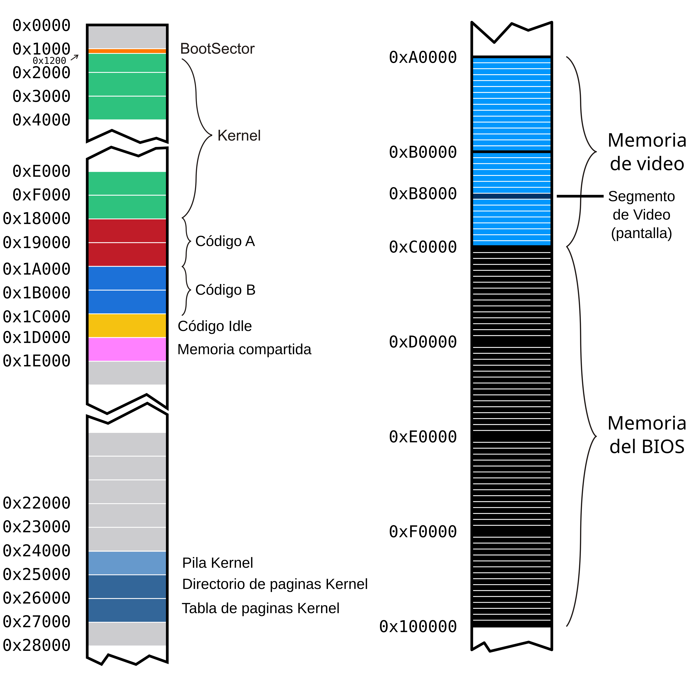
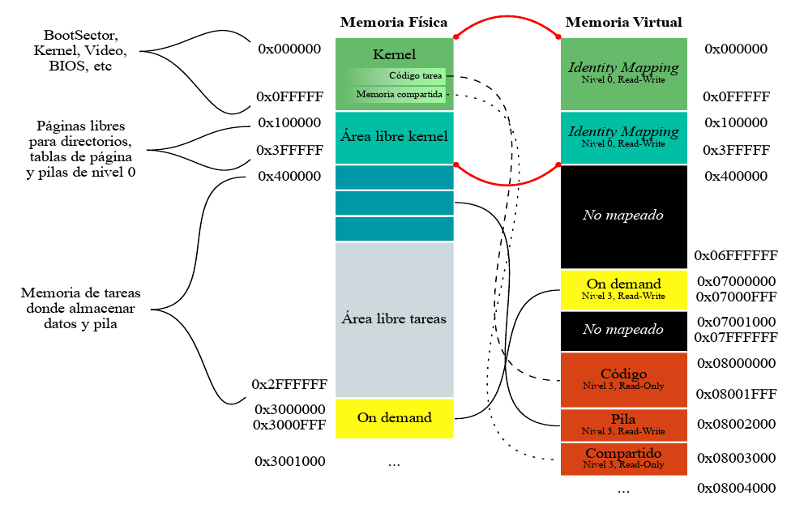

# System Programming: Tareas.

Vamos a continuar trabajando con el kernel que estuvimos programando en
los talleres anteriores. La idea es incorporar la posibilidad de
ejecutar algunas tareas específicas. Para esto vamos a precisar:

-   Definir las estructuras de las tareas disponibles para ser
    ejecutadas

-   Tener un scheduler que determine la tarea a la que le toca
    ejecutase en un período de tiempo, y el mecanismo para el
    intercambio de tareas de la CPU

-   Iniciar el kernel con una *tarea inicial* y tener una *tarea idle*
    para cuando no haya tareas en ejecución

Recordamos el mapeo de memoria con el que venimos trabajando. Las tareas
que vamos a crear en este taller van a ser parte de esta organización de
la memoria:





## Archivos provistos

A continuación les pasamos la lista de archivos que forman parte del
taller de hoy junto con su descripción:

-   **Makefile** - encargado de compilar y generar la imagen del
    floppy disk.

-   **idle.asm** - código de la tarea Idle.

-   **shared.h** -- estructura de la página de memoria compartida

-   **tareas/syscall.h** - interfaz para realizar llamadas al sistema
    desde las tareas

-   **tareas/task_lib.h** - Biblioteca con funciones útiles para las
    tareas

-   **tareas/task_prelude.asm**- Código de inicialización para las
    tareas

-   **tareas/taskPong.c** -- código de la tarea que usaremos
    (**tareas/taskGameOfLife.c, tareas/taskSnake.c,
    tareas/taskTipear.c **- código de otras tareas de ejemplo)

-   **tareas/taskPongScoreboard.c** -- código de la tarea que deberán
    completar

-   **tss.h, tss.c** - definición de estructuras y funciones para el
    manejo de las TSSs

-   **sched.h, sched.c** - scheduler del kernel

-   **tasks.h, tasks.c** - Definición de estructuras y funciones para
    la administración de tareas

-   **isr.asm** - Handlers de excepciones y interrupciones (en este
    caso se proveen las rutinas de atención de interrupciones)

-   **task\_defines.h** - Definiciones generales referente a tareas

## Ejercicios

### Primera parte: Inicialización de tareas

**1.** Si queremos definir un sistema que utilice sólo dos tareas, ¿Qué
nuevas estructuras, cantidad de nuevas entradas en las estructuras ya
definidas, y registros tenemos que configurar?¿Qué formato tienen?
¿Dónde se encuentran almacenadas?

Tenemos que crear una tarea inicial y las dos tareas en cuestión. Para cada una de las tareas, hay que crear un TSS para guardar su contexto. Luego, hay que crear la entrada en la GDT correspondiente a cada tarea. Este descriptor apunta a su respectivo TSS. Hay que tener un valor vàlido en el registro TR que apunta a la tarea en ejecución. Se encuentran almacenadas en memoria.

**2.** ¿A qué llamamos cambio de contexto? ¿Cuándo se produce? ¿Qué efecto
tiene sobre los registros del procesador? Expliquen en sus palabras que
almacena el registro **TR** y cómo obtiene la información necesaria para
ejecutar una tarea después de un cambio de contexto.

El cambio de contexto se realiza al pasar de una tarea a otra. Cuando ocurre, se guarda el contexto actual (el cual posee, por ejemplo, los registros del procesador) en la TSS de la tarea en ejecución (antes del cambio), y luego, se carga el contexto de la nueva tarea en el espacio de contexto de ejecución del CPU. El registro TR apunta a la TSS de la tarea actual en ejecución. Es decir, TR almacena el selector de segmento de la tarea en ejecución. Se usa para encontar la TSS de la tarea actual. En el cambio de contexto, TR pasa a tener el selector de segmento de la tarea nueva, permitiendo al procesador localizar y cargar el TSS correspondiente a la nueva tarea en la GDT.

**3.** Al momento de realizar un cambio de contexto el procesador va
almacenar el estado actual de acuerdo al selector indicado en el
registro **TR** y ha de restaurar aquel almacenado en la TSS cuyo
selector se asigna en el *jmp* far. ¿Qué consideraciones deberíamos
tener para poder realizar el primer cambio de contexto? ¿Y cuáles cuando
no tenemos tareas que ejecutar o se encuentran todas suspendidas?

En el primer cambio de contexto, hay que crear una tarea inicial, cuyo único propósito es proveer un espacio, la TSS, donde guardar el contexto. Cuando no tenemos tareas que ejecutar o se encuentran todas suspendidas, se ejecuta una tarea idle. La tarea idle garantiza que el sistema siempre tenga una tarea en ejecución.

**4.** ¿Qué hace el scheduler de un Sistema Operativo? ¿A qué nos
referimos con que usa una política?

Esto es gracias al scheduler, su política Round Robin y el cambio de contexto.

**5.** En un sistema de una única CPU, ¿cómo se hace para que los
programas parezcan ejecutarse en simultáneo?

El scheduler se encarga de asignar intervalos muy cortos a cada tarea de manera que parezca que las tareas están todo el tiempo en ejecución. 

**6.** En **tss.c** se encuentran definidas las TSSs de la Tarea
**Inicial** e **Idle**. Ahora, vamos a agregar el *TSS Descriptor*
correspondiente a estas tareas en la **GDT**.
    
a) Observen qué hace el método: ***tss_gdt_entry_for_task***

b) Escriban el código del método ***tss_init*** de **tss.c** que
agrega dos nuevas entradas a la **GDT** correspondientes al
descriptor de TSS de la tarea Inicial e Idle.

c) En **kernel.asm**, luego de habilitar paginación, agreguen una
llamada a **tss_init** para que efectivamente estas entradas se
agreguen a la **GDT**.

d) Correr el *qemu* y usar **info gdt** para verificar que los
***descriptores de tss*** de la tarea Inicial e Idle esten
efectivamente cargadas en la GDT

**7.** Como vimos, la primer tarea que va a ejecutar el procesador
cuando arranque va a ser la **tarea Inicial**. Se encuentra definida en
**tss.c** y tiene todos sus campos en 0. Antes de que comience a ciclar
infinitamente, completen lo necesario en **kernel.asm** para que cargue
la tarea inicial. Recuerden que la primera vez tenemos que cargar el registro
**TR** (Task Register) con la instrucción **LTR**.
Previamente llamar a la función tasks_screen_draw provista para preparar
la pantalla para nuestras tareas.

Si obtienen un error, asegurense de haber proporcionado un selector de
segmento para la tarea inicial. Un selector de segmento no es sólo el
indice en la GDT sino que tiene algunos bits con privilegios y el *table
indicator*.

**8.** Una vez que el procesador comenzó su ejecución en la **tarea Inicial**, 
le vamos a pedir que salte a la **tarea Idle** con un
***JMP***. Para eso, completar en **kernel.asm** el código necesario
para saltar intercambiando **TSS**, entre la tarea inicial y la tarea
Idle.

**9.** Utilizando **info tss**, verifiquen el valor del **TR**.
También, verifiquen los valores de los registros **CR3** con **creg** y de los registros de segmento **CS,** **DS**, **SS** con
***sreg***. ¿Por qué hace falta tener definida la pila de nivel 0 en la
tss?

La pila de nivel 0 definida en la TSS es necesaria para permitir una transición segura y controlada desde un nivel de privilegio bajo (nivel 3) a un nivel de privilegio alto (nivel 0).

**10.** En **tss.c**, completar la función ***tss_create_user_task***
para que inicialice una TSS con los datos correspondientes a una tarea
cualquiera. La función recibe por parámetro la dirección del código de
una tarea y será utilizada más adelante para crear tareas.

Las direcciones físicas del código de las tareas se encuentran en
**defines.h** bajo los nombres ***TASK_A_CODE_START*** y
***TASK_B_CODE_START***.

El esquema de paginación a utilizar es el que hicimos durante la clase
anterior. Tener en cuenta que cada tarea utilizará una pila distinta de
nivel 0.

### Segunda parte: Poniendo todo en marcha

**11.** Estando definidas **sched_task_offset** y **sched_task_selector**:
```
  sched_task_offset: dd 0xFFFFFFFF
  sched_task_selector: dw 0xFFFF
```

Y siendo la siguiente una implementación de una interrupción del reloj:

```
global _isr32
  
_isr32:
  pushad
  call pic_finish1
  
  call sched_next_task
  
  str cx
  cmp ax, cx
  je .fin
  
  mov word [sched_task_selector], ax
  jmp far [sched_task_offset]
  
  .fin:
  popad
  iret
```
a)  Expliquen con sus palabras que se estaría ejecutando en cada tic
    del reloj línea por línea

En el pushad, se guardan los registros generales en la pila. Esto es necesario para preservar el estado de la tarea actual antes de realizar cualquier operación que pueda modificar estos registros.
En call pic_finish1, se le avisa al pic que la interrupción está siendo atendida. Esto permite que el PIC continúe enviando nuevas interrupciones al procesador.
En call sched_next_task, nos fijamos cuál es la próxima tarea, y guardamos su selector en ax.
En str cx, nos guardamos el selector del segmento de tarea actual en el registro CX.
Luego, hay una comparación para saber si lo devuelto por call sched_next_task en ax es la tarea en ejecución o una nueva. Si es la misma tarea, salta a fin y se realiza un popad, para restaurar la pila. Sino, se salta a la nueva tarea.
El popad restaura el contexto de la tarea actual (o de la nueva tarea si se hizo el cambio).

b)  En la línea que dice ***jmp far \[sched_task_offset\]*** ¿De que
    tamaño es el dato que estaría leyendo desde la memoria? ¿Qué
    indica cada uno de estos valores? ¿Tiene algún efecto el offset
    elegido?

 El tamaño del dato que se lee desde la memoria es de 6 bytes, pues el sched_task_offset es de 4 bytes (es un dd) y el sched_task_selector es de 2 bytes (es un dw).Este tamaño se debe a que un jmp far necesita tanto un selector de segmento (2 bytes) como un offset de segmento (4 bytes). Entonces,

mov word [sched_task_selector], ax
jmp far [sched_task_offset]

equivale a hacer jmp <selector>:<offset>

El sched_task_selector indica el selector de segmento de la nueva tarea.
El sched_task_offset indica el offset dentro del selector de segmento de la nueva tarea.
El offset da igual.

c)  ¿A dónde regresa la ejecución (***eip***) de una tarea cuando
    vuelve a ser puesta en ejecución?

Regresa a la próxima instrucción que no fue ejecutada antes del cambio de tarea.

"Regresa a la próxima instrucción que no fue ejecutada antes del cambio de tarea, gracias a que el sistema operativo guarda el valor de EIP, permitiendo que la tarea continúe exactamente donde fue interrumpida."

**12.** Para este Taller la cátedra ha creado un scheduler que devuelve
la próxima tarea a ejecutar.

a)  En los archivos **sched.c** y **sched.h** se encuentran definidos
    los métodos necesarios para el Scheduler. Expliquen cómo funciona
    el mismo, es decir, cómo decide cuál es la próxima tarea a
    ejecutar. Pueden encontrarlo en la función ***sched_next_task***.

Dadas tareas vivas (eso significa, que tienen estado TASK_RUNNABLE), entre ellas, elige la siguiente tarea disponible con una política round-robin. Si no hay tareas disponibles, se salta a la tarea Idle.

b)  Modifiquen **kernel.asm** para llamar a la función
    ***sched_init*** luego de iniciar la TSS

c)  Compilen, ejecuten ***qemu*** y vean que todo sigue funcionando
    correctamente.

### Tercera parte: Tareas? Qué es eso?

**14.** Como parte de la inicialización del kernel, en kernel.asm se
pide agregar una llamada a la función **tasks\_init** de
**task.c** que a su vez llama a **create_task**. Observe las
siguientes líneas:
```C
int8_t task_id = sched_add_task(gdt_id << 3);

tss_tasks[task_id] = tss_create_user_task(task_code_start[tipo]);

gdt[gdt_id] = tss_gdt_entry_for_task(&tss_tasks[task_id]);
```
a)  ¿Qué está haciendo la función ***tss_gdt_entry_for_task***?

Creando una entrada en la GDT para la TSS de la tarea creada.

b)  ¿Por qué motivo se realiza el desplazamiento a izquierda de
    **gdt_id** al pasarlo como parámetro de ***sched_add_task***?

El desplazamiento se realiza para obtener el selector de la GDT para esa tarea. 
El desplazamiento a la izquierda permite colocar el índice (gdt_id) en la posición correcta dentro del selector de segmento.

**15.** Ejecuten las tareas en *qemu* y observen el código de estas
superficialmente.

a) ¿Qué mecanismos usan para comunicarse con el kernel?

Syscalls, interrupciones, Memoria compartida

b) ¿Por qué creen que no hay uso de variables globales? ¿Qué pasaría si
    una tarea intentase escribir en su `.data` con nuestro sistema?

No hay uso de variables globales para evitar conflictos, proteger la memoria de cada tarea y facilitar el cambio de contexto. Cada tarea tiene su propia sección .data, que es privada y aislada de otras tareas. Si una tarea intenta escribir fuera de su espacio de direcciones permitido, el sistema operativo genera una excepción, asegurando que una tarea no pueda afectar la integridad de los datos de otras o del propio kernel.

Si una tarea intentase escribir en su .data:
La sección .data de una tarea está en el espacio de memoria de esa tarea y es independiente de las secciones .data de otras tareas. Esto es gracias a la virtualización,  donde cada tarea tiene su propio espacio de direcciones. Cuando una tarea escribe en su .data, realmente está escribiendo en una copia privada de esos datos, y no interfiere con otras tareas. Esto permite que cada tarea mantenga su estado y datos privados.

c) Cambien el divisor del PIT para \"acelerar\" la ejecución de las tareas:

```
    ; El PIT (Programmable Interrupt Timer) corre a 1193182Hz.

    ; Cada iteracion del clock decrementa un contador interno, cuando
    éste llega

    ; a cero se emite la interrupción. El valor inicial es 0x0 que
    indica 65536,

    ; es decir 18.206 Hz

    mov ax, DIVISOR

    out 0x40, al

    rol ax, 8

    out 0x40, al
```

**16.** Observen **tareas/task_prelude.asm**. El código de este archivo
se ubica al principio de las tareas.

a. ¿Por qué la tarea termina en un loop infinito?

Para ejecutar en todo momento una tarea. 

b. \[Opcional\] ¿Qué podríamos hacer para que esto no sea necesario?

### Cuarta parte: Hacer nuestra propia tarea

Ahora programaremos nuestra tarea. La idea es disponer de una tarea que
imprima el *score* (puntaje) de todos los *Pongs* que se están
ejecutando. Para ello utilizaremos la memoria mapeada *on demand* del
taller anterior.

#### Análisis:

**18.** Analicen el *Makefile* provisto. ¿Por qué se definen 2 "tipos"
de tareas? ¿Como harían para ejecutar una tarea distinta? Cambien la
tarea S*nake* por una tarea *PongScoreboard*.

Se definen dos tipos de tarea para poder ejecutar más de un solo tipo de tarea. (?)
Para ejecutar una tarea distinta solo hay que modificar la variable TASKA o TASKB. 

**19.** Mirando la tarea *Pong*, ¿En que posición de memoria escribe
esta tarea el puntaje que queremos imprimir? ¿Cómo funciona el mecanismo
propuesto para compartir datos entre tareas?

La memoria compartida es una técnica en la que dos o más tareas comparten una región de memoria a la que ambas tienen acceso. Este mecanismo es eficiente para compartir grandes cantidades de datos rápidamente, ya que evita la copia de datos entre espacios de direcciones de las tareas.

Asignación de Memoria Compartida: El kernel asigna un bloque de memoria que es accesible para las tareas que necesitan comunicarse. Este bloque de memoria se asigna en una dirección virtual en el espacio de cada tarea, de modo que ambas puedan leer y escribir en la misma región.

#### Programando:

**20.** Completen el código de la tarea *PongScoreboard* para que
imprima en la pantalla el puntaje de todas las instancias de *Pong* usando los datos que nos dejan en la página compartida.

**21.** \[Opcional\] Resuman con su equipo todas las estructuras vistas
desde el Taller 1 al Taller 4. Escriban el funcionamiento general de
segmentos, interrupciones, paginación y tareas en los procesadores
Intel. ¿Cómo interactúan las estructuras? ¿Qué configuraciones son
fundamentales a realizar? ¿Cómo son los niveles de privilegio y acceso a
las estructuras?

**22.** \[Opcional\] ¿Qué pasa cuando una tarea dispara una
excepción? ¿Cómo podría mejorarse la respuesta del sistema ante estos
eventos?
