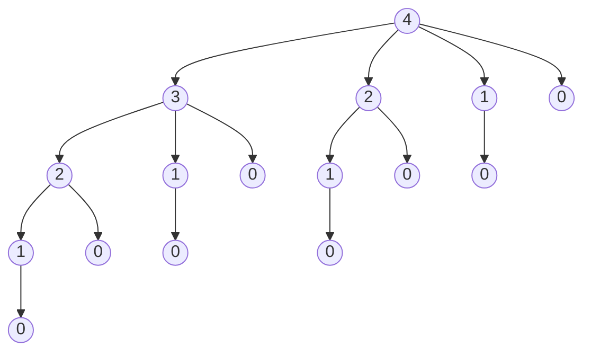
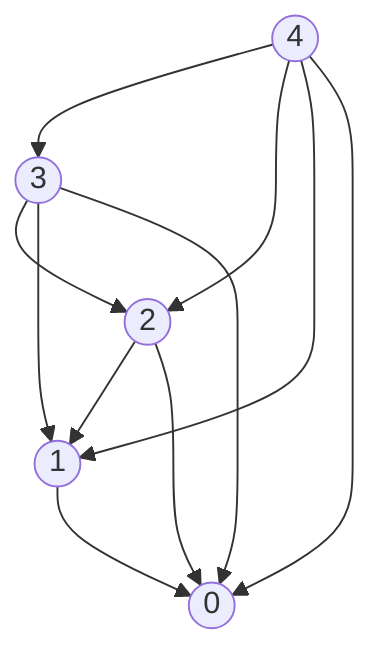

Dado una vara de longitud $n$ y un tabla de precios $p_i$ para i = 1, 2, ..., n, determinar la maxima ganancia $r_n$ obtenible cortando la vara y vendiendo la partes. Si el precio $p_n$  para una vara de longitud $n$ es lo suficientemente grande, una solucion optima podria no requerir ningun corte en absoluto.

Consideremos el caso donde $n = 4$. Cortar una vara de longtud 4cm a 2cm produce ganancia $p_2 + p_2 = 5 + 5 = 10$, el cual es optimo.

La vara de longtud $n$ se puede cortar en $2^{n-1}$, ya que tenemos la opcion de cortar o no cortar, a una distancia $i$ del extremo izquierdo, para  $i = 1,2,...,n-1$ . Denotamos una descomposicion en trozos utilizando notacion aditiva ordinaria, de modo que $7 = 2 + 2 + 3$ indica que una vara de longitud 7 es cortada en 3 trozos, dos de longitud 2 y uno de longitud 3. Si una solucion optima corta la vara en k trozos, para algun $1 \leq k \leq n$, entonces una descomposicion optima : $n = i_1  +  i_2  +  ...  +  i_k$ 

	length i | 1   2   3   4   5   6   7   8   9   10
	price pi | 1   5   8   9   10  17  17  20  24  30

En la implementacion **Top-Down** sin **programacion dinamica** se resuelve recursivamente, entonces el algoritmo toma como input un array $p[1:n]$ de los precios y un entero n, y retorna la maxima ganacia posible de una vara de longitud n, para una vara de tamaño 0 no hay ganancia posible por lo que devolvemos 0.

Cut-Road(p, n)
if $n == 0$ 
	return 0
q = -inf

for i = 1 to n
	q = max(q, p[i] + Cut-Road(p, n-1))
return q

>Arbol de toma de decisiones cuando n = 4

>Ahora implementaremos Cut-Road usando programacion dinamica

A comparacion de resolver el mismo subproblema repetidamente, vamos a querer que cada subproblema se resuelva una unica vez. Para esto cuando resolvamos por primera vez el subproblema lo vamos a guardar. Para cuando necestimos este subproblema lo podamos encontrar facilmente y no tener que hacerlo de nuevo.

 Guardar los subproblemas viene con un costo, hay usar memoria demas para almacenarlos. La programacion dinamica justamente sirve como compesacion de memoria por tiempo.

Hay dos maneras de implementar un algoritmo de *programacion dinamica*.

 [Top-Down con memozacion] 

En esta implementacion, vamos a escribir recursivamente el programa guardando todos los subproblemas que vamos resolviendo recursivamente. Lo primero que hacemos es verificar que si ya tenemos guardado el subproblema lo devolvemos, evitandonos hacer ese subproblema de nuevo. 

[Bottom-Up]

Este metodo depende en el "tamaño" del subproblema, talque resolver cualquier subproblema depende solo en resolver "pequeños" subproblemas. Primero resolvemos los subproblemas mas chicos, guardandonos los resultados de cada subproblema cuando sea resuelto. De esta manera, cuando resolvemos un subproblema en particular, ya tenemos soluciones guardadas de los subproblemas mas chicos, para que este en particular sea resuelto. Entonces cuando encaremos el problema que queremos resolver, ya vamos a tener los prerequisitos para resolverlo.

Estos dos metodos tienen casi siempre la misma complejidad, a veces el metodo top-down no resuelve todos los subproblemas, por lo que nos ahorra algo de tiempo.

![[Screenshot from 2024-05-11 13-11-52.png]]

>Grafo de como seria el Rod Cut con proramacion dinamica

